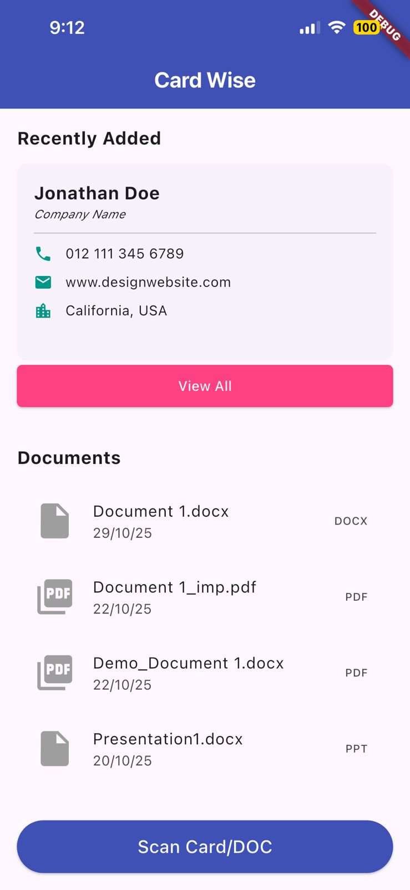
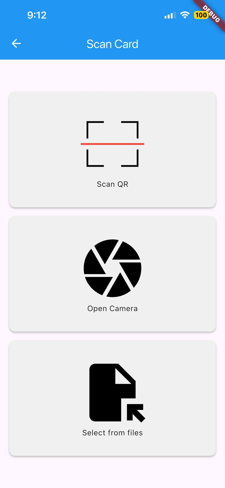

# OpenHack-2.0: AI-Powered Contact Digitization & Contextual Search

An end-to-end AI-powered product designed to digitize physical business cards into structured data and enable natural language search over contact records. Instead of relying on exact-match fields, users can retrieve contacts using vague, contextual queries.

This project covers the full product lifecycle: from problem framing and OCR data pipeline design through LLM integration, prompt engineering, and iterative testing based on query accuracy—translating a manual workflow into an AI-native product experience.

## 🚀 Key Features

* **Advanced OCR Pipelines:** Automatically scans and extracts text data from physical business cards.
* **Contextual Search:** Integrated with Llama LLM to allow natural language queries (e.g., *"Find that web developer I met at the hackathon who mentioned rust"*).
* **Direct Communication:** Users can initiate phone calls directly from the app interface by clicking on a contact's phone number.
* **Cloud-Native Storage:** Backed by CockroachDB for reliable, distributed, and scalable data persistence.

## 📸 Screenshots

| Home Screen | Scan Options |
| :---: | :---: |
|  |  |

*(Note: The third application screenshot can be added here or inside the functional documentation sections below)*

## 🛠️ Tech Stack

* **Large Language Model:** Llama LLM (Prompt Design & Contextual Search Translation)
* **Database:** CockroachDB (Distributed SQL Database)
* **Core Components:** 
  * `UI` - User Interface and interaction layers
  * `OCR` - Text recognition and extraction processing pipelines
  * `Node` - Backend services and orchestration layer

## 📁 Repository Structure

```text
├── assets/               # Application screenshots and visual assets
│   ├── home.jpg          # Home screen view
│   └── scan.jpg          # Document / card scanning interface options
├── UI/                   # Frontend UI components
├── OCR/                  # Optical Character Recognition pipelines
└── Node/                 # Backend server and API integration logic
```

## ⚙️ Getting Started

### Prerequisites
* A running instance or connection string for **CockroachDB**.
* API access keys/endpoints for the **Llama LLM** environment.

### Installation
1. Clone the repository:
   ```bash
   git clone https://github.com
   cd OpenHack-2.0
   ```
2. Configure your environment variables for database connectivity and LLM configurations.
3. Explore the `Node/`, `OCR/`, and `UI/` directories to build and run their respective environments.
